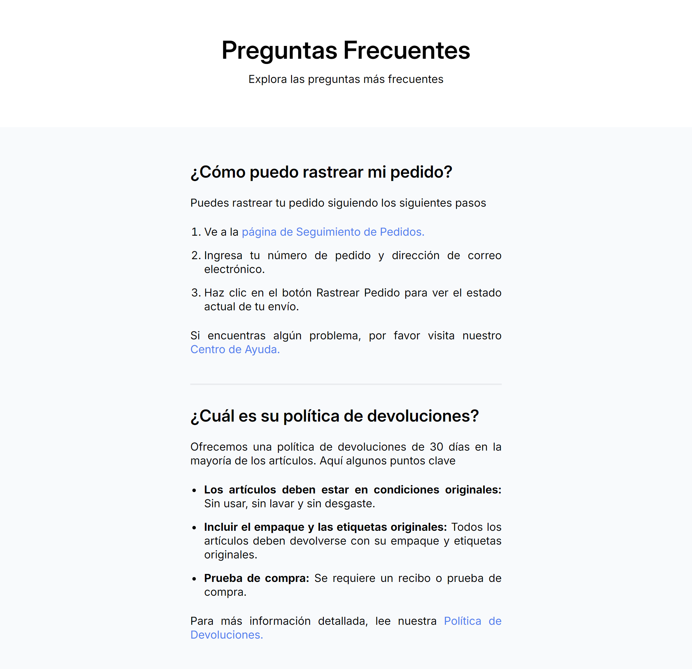

# Proyecto-de-Preguntas-Frecuentes

Este es un proyecto de Preguntas Frecuentes creado con **HTML** y **CSS**. La aplicación tiene como objetivo mostrar una lista de preguntas frecuentes sobre una tienda en línea, como el rastreo de pedidos y la política de devoluciones. El diseño es completamente responsive, asegurando una correcta visualización en diferentes tamaños de pantalla.

## Características

- **Interfaz amigable**: Interfaz simple y fácil de usar para explorar las preguntas frecuentes.
- **Responsive Design**: El diseño se adapta a diferentes tamaños de pantalla, desde dispositivos móviles hasta monitores de escritorio.
- **HTML semántico**: Estructura clara y accesible.
- **Uso de listas ordenadas y no ordenadas**: Presenta pasos e información en formato de lista para facilitar la lectura.
- **Uso de enlaces internos**: Enlaces para navegar a páginas relacionadas como "Seguimiento de Pedidos" y "Política de Devoluciones".

## Tecnologías Utilizadas

- **HTML**: Para la estructura de la página.
- **CSS**: Para el estilo y diseño visual del sitio.
- **Google Fonts**: Para las fuentes tipográficas.

## Vista Previa del Proyecto



## Cómo Ejecutarlo Localmente

1. Clona el repositorio:
    ```bash
    git clone https://github.com/tu-usuario/nombre-del-repositorio.git
    ```
2. Navega a la carpeta del proyecto:
    ```bash
    cd nombre-del-repositorio
    ```
3. Abre el archivo `index.html` en tu navegador.

## Estructura del Proyecto

```bash
/
├── index.html
├── style.css
└── README.md

